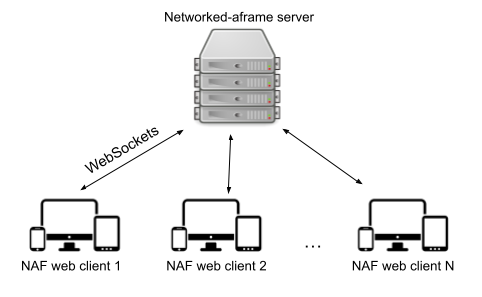
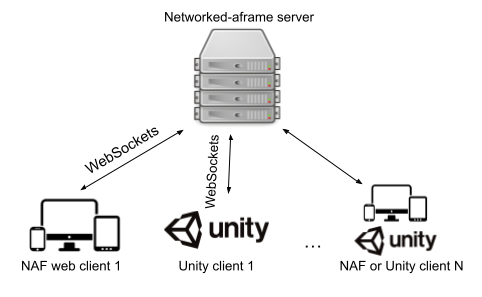

# Documentation
The following documentation details how each component within networked-aframe-unity-client (NAF-unity-client) works, how it interacts with networked-aframe (NAF), and how you can get this library working within your own Unity project.

Before continuing, I highly recommend reading through the [networked-aframe documentation](https://github.com/networked-aframe/networked-aframe). Using this library assumes some level of familiarity with what networked-aframe is and how it works.

## How It Works
For a typical networked-aframe (NAF) experience, the way it works is that there is an A-Frame web app running in the browser, and that A-Frame app includes NAF components. Each NAF enabled web app communicates updates to a NAF enabled server, and the server broadcasts those updates out to each NAF web app using WebSockets. 

In the NAF-unity-client scenario, the setup is largely the same. There is still a NAF-enabled WebSocket server, and each A-Frame web app is still communicating with it using WebSockets. The only difference in this scenario is that there is also a Unity client that is connecting to the NAF WebSocket server. That Unity client is reading the messages being broadcast from the other web apps, and it is broadcasting messages of its own, communicating updates for the networked objects being generated from the Unity client.

## Key Components
The following section reviews the key components/classes in the NAF-unity-client library and their corresponding components in networked-aframe.

### NAFScene
The `NAFScene` class defines the key properties required to establish the connection to the NAF server, and it facilitates the communication with and coordination of networked entities with the server and other clients. The `NAFScene` in Unity is analagous to the `<a-scene>` component [defined in networked-aframe](https://github.com/networked-aframe/networked-aframe#scene-component). 

There are a number of properties that need to be defined for a NAFScene. These properties should generally align with the same properties defined in the NAF `<a-scene>` component.

| Property name | Description | Default Value |
| --- | --- | ---|
| Server Url | The URL for the networked-aframe server that the Unity client will connect to | http://localhost:8080 |
| Room To Join | Unique room name. Can be multiple per app. Spaces are not allowed. There can be multiple rooms per app and clients can only connect to clients in the same app & room.	| dev |
| Template Prefabs | Specify the Unity objects that will be created for networked entities. For example, if an A-Frame browser client creates a new networked object, the Unity app will use one of the templates in this list to create that networked object within the Unity app. | [] |
| Network Updates Per Second | How many updates per second the Unity client will send to the NAF server | 15 |