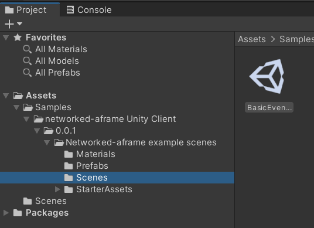
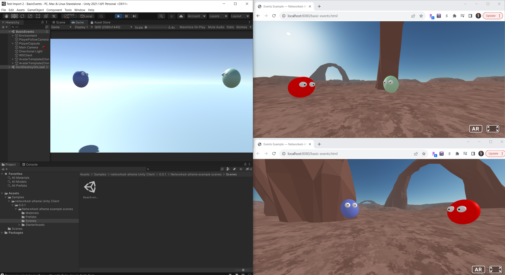

# networked-aframe-unity-client

## Description

**Build cross-platform, multi-user VR experiences across the Web, VR headsets, native mobile apps, and more.**

A client library that allows Unity projects to interact with [networked-aframe](https://github.com/networked-aframe/networked-aframe).

## Getting Started
Follow the steps below to get a networked-aframe-unity-client (NAF-unity-client) example scene up and running that includes integration with networked-aframe.

### Setup

First, create a new Unity project. In your Unity project, set the correct Player Settings required for this library:
- Go to Player Settings
    - Set "Scripting Backend" to IL2CPP
    - Set "API Compatibility Level" to ".NET 4x"

Next, download the NAF-unity-client library:

- Copy the URL `https://github.com/ttravaglini/networked-aframe-unity-client.git`
    - In Unity, go to Window --> Package Manager --> click (+) --> Add Package from Git URL
    - Paste in the URL for this package

### Example

Next, download the example scene for this library. 
- From the Package Manager window, once the NAF-unity-client package download finishes, expand the "Samples" dropdown for this package and import the "Networked-aframe example scenes" sample
- From the Project window, navigate to the imported "Networked-aframe example scenes" folder
    - Open the "BasicEvents" scene

Next, get networked-aframe running locally:

- Go to the [networked-aframe repo](https://github.com/networked-aframe/networked-aframe) and follow the steps in their [Getting Started section](https://github.com/networked-aframe/networked-aframe#getting-started)
- At the end of that process, you should have the NAF server running and be able to browse the examples at http://localhost:8080
- Open http://localhost:8080 and then open the example ["Basic with events"](http://localhost:8080/basic-events.html)

At this point, you have the Basic Events example from NAF running in your browser window and the corresponding example scene open in Unity. Now, you can click the Run button in Unity. This will start up the example Unity scene, and you should be able to see and interact with the avatar from the browser window (and vice-versa)! To further explore the functionality, you can open up more than one browser window pointing to the [Basic Events NAF example](http://localhost:8080/basic-events.html), which will cause multiple avatars to appear in each of the clients.

_In this screenshot, we have two browser clients and one Unity client running the Basic Events scene with networked-aframe. The Unity client is represented by the red avatar, and the browser clients are represented by the blue and light green avatars._

https://github.com/ttravaglini/networked-aframe-unity-client/assets/10555826/c2ebbd48-815a-47bc-9cb1-649e1b88d950

_This video shows the same scenario as above; it shows two browser clients and one Unity client running the Basic Events scene with networked-aframe._

## Documentation
Go to the [Components Documentation](Documentation~/ComponentsDocumentation.md) for more information on how each NAF-unity-client component works and how to integrate it into your own Unity project.

## Limitations
- Currently this library only works in conjunction with the default `wseasyrtc` network adapter within networked-aframe, and it has only been tested locally.
- Only a subset of the functionality from NAF has been ported over. Certain functionality, such as object persistence, ownership transfer, custom messages, and more are not yet functional.
- If you're interested in helping out with fixing these issues and others, please consider contributing!

## License

Networked-aframe-unity-client is available under the MIT license.

## Acknowledgement

- [SocketIOUnity](https://github.com/itisnajim/SocketIOUnity)
- [networked-aframe](https://github.com/networked-aframe/networked-aframe)
- [A-Frame](https://aframe.io/)
